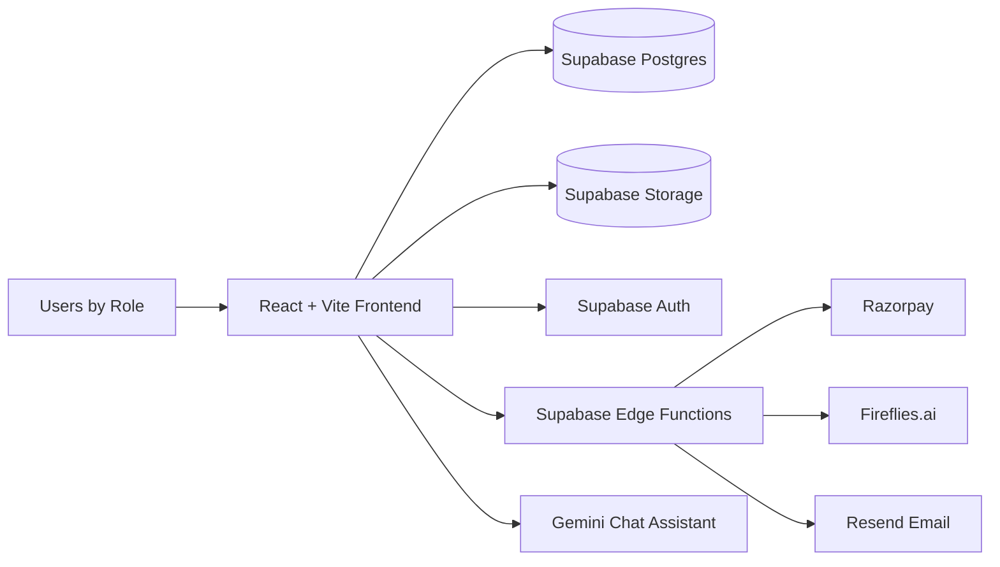
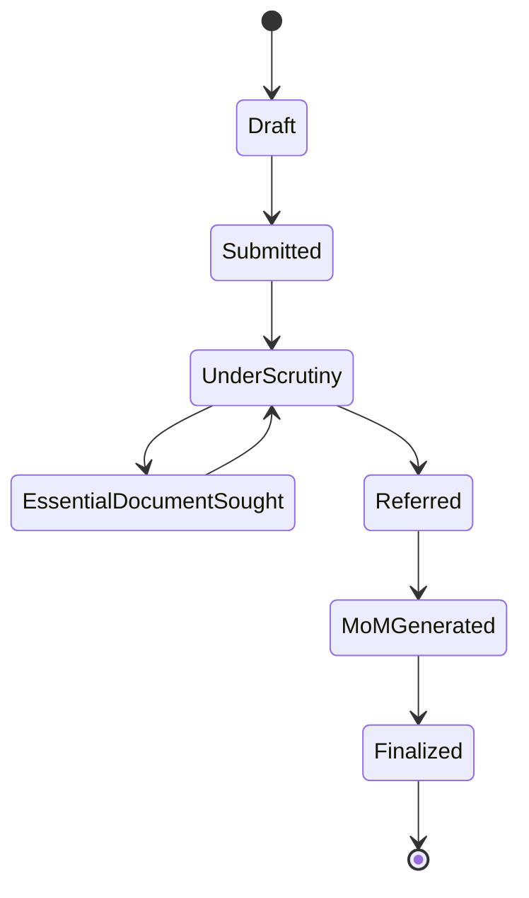
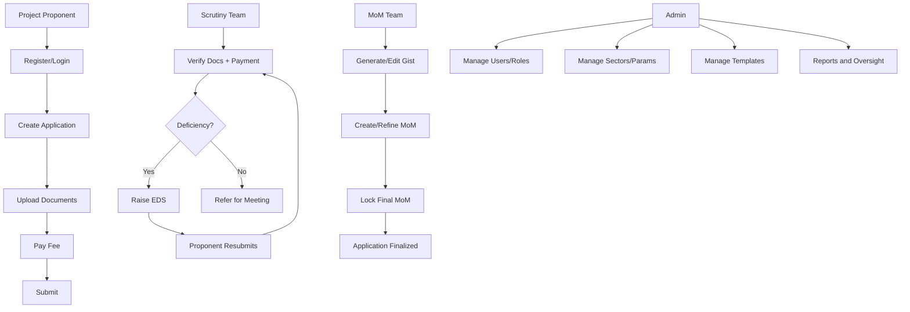
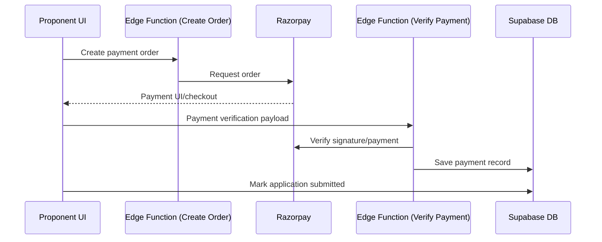

# Parivesh 3.0 — Complete Project Context for PPT

## 1) Executive Summary

Parivesh 3.0 is a role-based environmental clearance workflow platform for CECB (Chhattisgarh Environment Conservation Board).  
It digitizes the full lifecycle from application filing to final Minutes of Meeting (MoM), with status tracking, document workflows, scrutiny handling, and payment integration.

Core value:
- Faster and traceable clearance lifecycle
- Reduced manual coordination across teams
- Better role isolation and governance visibility

---

## 2) Problem Statement Baseline (From Provided PDF)

### Objective
Build a unified web portal for complete environmental clearance lifecycle:
- Filing by Project Proponent
- Scrutiny and deficiency handling
- Meeting referral and gist creation
- MoM generation/finalization and publication

### Required Roles
- Admin
- Project Proponent / Recognized Qualified Professional
- Scrutiny Team
- MoM Team

### Required Stages
- Draft
- Submitted
- Under Scrutiny
- Essential Document Sought
- Referred
- MoM Generated
- Finalized

### Required Technical Focus
- Modern web UI
- Role-based security
- Workflow integrity
- Word/PDF export
- Payment integration (UPI/QR)

---

## 3) Current Solution Overview (As Implemented)

### Product Scope Implemented
- Role-aware login and dashboard routing
- Multi-page application filing with document upload
- Scrutiny review and EDS loop
- Meeting gist and MoM management
- Razorpay payment flow
- Admin modules (users, sectors, templates, reports)
- Notifications and status history timeline

### High-Level System Design

---

## 4) Architecture Breakdown

### Frontend
- React + TypeScript + Vite
- Routing with protected role-based routes
- Component system using Tailwind + shadcn/ui
- State/data with Context API + TanStack Query

### Backend / Platform
- Supabase PostgreSQL for core data
- Supabase Auth for authentication
- Supabase Storage for document lifecycle
- Supabase Edge Functions for integrations:
  - Razorpay order creation and payment verification
  - Fireflies meeting transcript handling
  - Email dispatch

### Core Functional Modules
- Authentication and profile
- New application creation
- Application list and detail
- Scrutiny review
- EDS deficiency handling
- MoM gists and final minutes
- Admin (users, sectors, templates, reports)
- Public verification and notifications

---

## 5) Workflow Design (As-Is)

### End-to-End Status Lifecycle

### Role-Wise Operating Flow

### Payment + Submission Sequence

---

## 6) Requirement Coverage Matrix

| Requirement (Problem Statement) | Coverage Status | Notes |
|---|---|---|
| Role-based access control | Largely Implemented | Roles exist and routing + DB role policies are present |
| Admin role assignment | Implemented | Admin user management and role workflows present |
| Proponent registration & filing | Implemented | Login/register and multi-step filing available |
| Secure document upload | Implemented | Storage + docs flow exists |
| Fee payment (UPI/QR) | Partially Implemented | Razorpay integrated; UPI/QR path should be explicitly validated in UX flow |
| Scrutiny document verification | Implemented | Scrutiny queue and action flows present |
| EDS deficiency cycle | Partially Implemented | Workflow exists but one data model mismatch impacts reliability |
| Refer to meeting + gist generation | Implemented | Referred stage and gist tooling available |
| MoM generation and lock | Implemented | MoM draft/finalization flow exists |
| Export to Word/PDF | Implemented | Document export utilities included |
| Linear workflow progression | Partially Implemented | Stages exist, but strict transition guards need strengthening |

---

## 7) What Is Missing / Needs Improvement

### A) Functional Gaps
- No explicit rejection/denial status in the application status enum, while parts of UI expect a rejected state
- EDS points table naming mismatch (`eds_points` vs `eds_deficiency_points`) can break deficiency list retrieval
- No strong formal approval chain controls (e.g., checkpointed transitions, escalation/SLA)
- Finalized MoM visibility path for proponent/public can be made clearer as a dedicated output flow

### B) Security Gaps (High Priority)
- Hardcoded API secrets found in edge function code (must move entirely to environment variables and rotate keys)
- Route guard logic allows edge case when role is null while role-restricted route is requested
- Workflow status changes can be updated too flexibly in bulk operations without strict transition validation rules
- Test/demo credentials present in repository docs/components should be removed or isolated

### C) UX/Operational Gaps
- Route mismatch in one scrutiny navigation path
- More explicit workflow dashboards (pending by role, SLA aging, bottleneck detection) can improve operational adoption
- Public verification experience can be tightened for consistent schema relations and clearer status semantics

---

## 8) Recommended Improvement Plan (Prioritized)

### Priority 1 — Security and Integrity (Immediate)
1. Remove hardcoded secrets, use secure env-only injection, and rotate exposed keys
2. Fix role-guard logic for strict denial on missing/invalid role
3. Enforce server-side status transition rules (allowed state machine matrix)
4. Clean test/demo credentials from production-visible artifacts

### Priority 2 — Workflow Correctness
1. Add explicit `rejected` (and optional `withdrawn`) lifecycle statuses if required by business process
2. Resolve EDS table/model naming mismatch
3. Add transition audit constraints and reason capture for critical actions
4. Ensure complete proponent-facing finalized MoM retrieval/publication

### Priority 3 — Product Maturity
1. Add SLA and queue aging analytics
2. Introduce template versioning and approval for meeting artifacts
3. Add stronger regression test coverage for role permissions and workflow transitions
4. Improve status communication copy and multilingual consistency

---

## 9) PPT-Ready Slide Outline

1. Problem Context and Governance Need  
2. Vision: Unified Environmental Clearance Platform  
3. User Roles and Responsibility Matrix  
4. Current System Architecture  
5. End-to-End Workflow (Status State Diagram)  
6. Payment + Scrutiny + MoM Process Flow  
7. Feature Coverage vs Problem Statement  
8. Gap Analysis (Functional, Security, UX)  
9. Improvement Roadmap (Priority 1/2/3)  
10. Expected Impact (speed, transparency, accountability)  

---

## 10) One-Line Positioning for Presentation

Parivesh 3.0 is a near-complete role-based clearance workflow platform with strong foundational coverage, and its next major gains come from security hardening, workflow integrity enforcement, and operational maturity enhancements.
